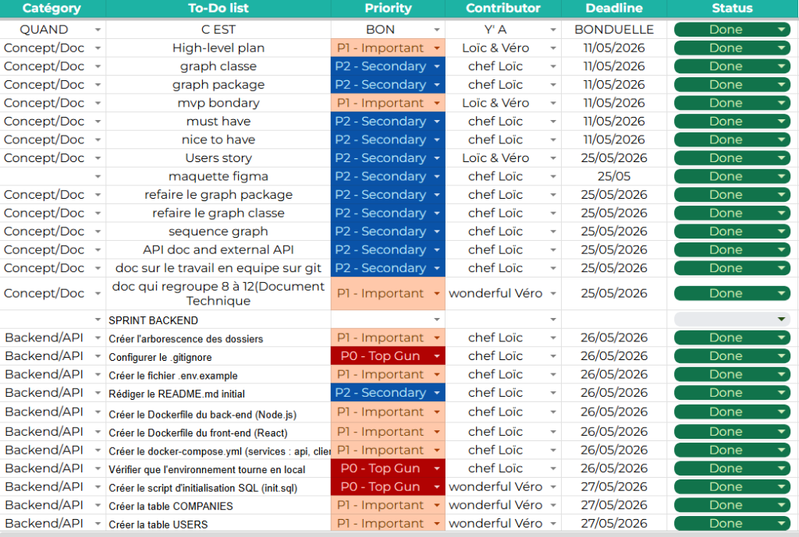

# <picture><source media="(prefers-color-scheme: dark)" srcset="../images/logo_4.png"><source media="(prefers-color-scheme: light)" srcset="../images/logo_2.png"></picture>  
## MVP Development & Execution


## Table of Contents
- [Project Overview](#project-overview)
- [MVP Goal](#mvp-goal)
- [0. Sprint Planning](#0-sprint-planning)
- [1. Execute Development Tasks](#1-execute-development-tasks)
- [2. Monitor Progress and Adjust](#2-monitor-progress-and-adjust)
- [3. Conduct Sprint Reviews and Retrospectives](#3-conduct-sprint-reviews-and-retrospectives)
- [4. Final Integration and QA Testing](#4-final-integration-and-qa-testing)
- [5. Bug Tracking](#5-bug-tracking)
- [6. Testing Evidence and Results](#6-testing-evidence-and-results)
- [7. Production Environment](#7-production-environment)
- [MVP Delivery Summary](#mvp-delivery-summary)
- [What's Next](#whats-next)
- [Acknowledgements](#acknowledgements)

---

## Project Overview

**PRIM'O** is a B2B2C SaaS platform enabling real-time meritocratic recognition in SMEs.  
Employers allocate tokens to employees instantly upon observed performance.  
Employees redeem tokens for exclusive vouchers (promo codes) via an integrated marketplace.

**Team :** Loïc Cerqueira (Tech Lead / Security) · Véronique Beauvais (UX / Data)  
**Stage 4 period :** May 26 – July 2, 2026  
**Repository :** [github.com/Veroniquebvs/prim_o](https://github.com/Veroniquebvs/prim_o)

---

## MVP Goal

The goal of this MVP is to :
- Deliver a fully functional platform allowing employers to purchase tokens via Stripe and instantly allocate them to employees.
- Provide employees with a mobile-friendly interface to view their balance, browse the marketplace, and redeem vouchers.
- Introduce the role of the **Manager** (new role added during development) so team leads can distribute tokens to their collaborators independently.
- Establish a secure, tested architecture ready for a pilot deployment with real SME customers.

---

## 0. Sprint Planning

### Objective
Structure development into four focused sprints, each with a clear scope and deliverables, to cover the full stack in five weeks.

### Methodology : MoSCoW (inherited from Stage 3)

| Priority | Description |
|---|---|
| **Must Have** | JWT authentication, token allocation (atomic), Stripe payment flow, voucher marketplace, admin and employer dashboards. |
| **Should Have** | Employee push notifications, transaction history, employer analytics feed. |
| **Could Have** | Manager role, scheduled allocations, avatar customization, QR-code onboarding. |
| **Won't Have** | Geolocation, multi-language support, native mobile app (beyond MVP scope). |

### Sprint Structure

- **Duration :** ~1–2 weeks per sprint.
- **Tools :** GitHub Projects for issue tracking, GitHub Flow for SCM, Postman for API validation.
- **Roles :** 
  - **Loïc :** Backend architecture, API, security, DevOps (Render deployment), Vercel deployment, UX.
  - **Véronique :** Backend, Database, Frontend (React/TypeScript), UX.
- **Merge policy :** All work goes through `feature/*` or `dev` branches, reviewed via PR before merging into `main`. No direct pushes to `main`.

### Sprint Planning (MVP Execution)

| Sprint | Period | Objective (Focus) | Priorities (MoSCoW) | Responsibility |
| :--- | :--- | :--- | :--- | :--- |
| **S1** | 05/11 - 05/25 | **Design & Doc** | Must Have: Architecture, User Stories | Loïc & Véronique |
| **S2** | 05/26 - 06/15 | **Backend Development** | Must Have: API, Database | Loïc & Véronique |
| **S3** | 06/16 - 06/26 | **Testing & Quality** | Must Have: Jest, Supertest, Unit Tests | Loïc & Véronique |
| **S4** | 06/27 - 07/15 | **MVP Finalization** | Must Have: Polish, UI/UX, Deployment | Loïc & Véronique |

---

## 1. Execute Development Tasks

### Purpose
To implement features and deliverables according to the sprint plan.

### Developers
*   **Technical Implementation (Backend) :** Developed the REST API using Express.js and Sequelize ORM.
    *   *Main Endpoints :*
        *   `POST /api/auth/register` : Registers a new user (employee or employer).
        *   `POST /api/auth/login` : Connects a user and generates secure JSON Web Tokens (Access & Refresh JWT).
        *   `GET /api/auth/me` : Retrieves the authenticated user's profile securely (excluding sensitive fields like `password_hash`).
        *   `POST /api/tokens/purchase` : Initializes a token purchase by an employer via Stripe (returns a *PaymentIntent* `client_secret`).
        *   `POST /api/tokens/webhook` : Processes successful Stripe payments to automatically credit the company's token balance.
        *   `POST /api/tokens/allocate` : Handles token distribution from employers or managers to employees (wrapped in atomic PostgreSQL transactions).
        *   `GET /api/marketplace/items` : Lists available vouchers in the catalog.
        *   `POST /api/marketplace/redeem` : Redeems accumulated tokens for a voucher (generates a partner promo code).
*   **Technical Implementation (Frontend) :** Developed the responsive client application using React and TypeScript (mobile-first PWA).
    *   *Main Pages :*
        *   `LoginPage` & `RegisterPage` : Connection and account creation pages (supporting onboarding via QR code).
        *   `PourToi` (Employee) : Dashboard displaying token balance, activity history (received tokens), and recommended voucher carousels.
        *   `PourToi` (Manager) : Interface for team leads to view the team token budget, instantly allocate tokens to team members, and configure scheduled allocations.
        *   `EmployerDashboard` : Employer dashboard to purchase tokens (Stripe), configure employee roles, and generate onboarding QR codes.
        *   `Catalogue` : Marketplace to browse and filter partner vouchers (Fnac, Decathlon, etc.).
        *   `VoucherDetail` : Detailed view of a voucher with description and a redemption confirmation button.
        *   `Historique` : Full chronologic tracking of all transactions and orders.
        *   `AdminDashboard` : System admin view to approve companies and manage the global voucher catalog.

### Software Configuration Management (SCM)
*   **Branching Strategy :** Adhered to the *GitHub Flow* branching strategy. The `main` branch is protected, and direct pushes are disabled. All features are developed on dedicated branches (`feature/*` or `dev`).
*   **Review & Integration :** Merging requires at least one peer review on a Pull Request (between Loïc and Véronique).
*   **Commit Normalization :** Enforced standard commit messages (e.g., `feat(auth):...`, `fix(db):...`, `test(vouchers):...`).

### Quality Assurance (QA)
*   **Automated Tests :** Maintained and executed a test suite of 141 tests (unit tests with Jest on services like Stripe/Token, and integration tests with Supertest to validate route security and RBAC).
*   **Security & Compliance :** Enforced strict multi-tenant boundaries (Company A cannot read/write Company B's data) and verified role-based access control (RBAC).
*   **Manual & E2E Testing :** Executed the E2E script `practical-test.js` simulating a complete user journey (Stripe purchase, token allocation, redemption) and manually validated mobile interfaces in a local Docker environment.

---

## 2. Monitor Progress and Adjust

### Purpose
To track team performance, measure progress, and address any issues.

### Communication & Operations
*   **Daily Standups & Reports :** Daily standup meetings were conducted every morning to review completed tasks, discuss blockers, and plan the day’s work. A progress report was compiled and shared at the end of each day to document what was accomplished.
*   **Primary Tool :** **Discord** was used as the main communication channel for daily standups, instant messaging, and general team coordination.

### Task Tracking & Sprint Backlog
*   **ToDo List :** All development and design tasks were organized and tracked using a structured ToDo List. Below is the screenshot of the sprint planning and progress board :



### Key Metrics
*   **Sprint Velocity :** Approximately **18 tasks** were completed each week, maintaining a high and consistent pace of delivery.
*   **Completion Rate :** **100%** of the planned tasks for the MVP were successfully completed.
*   **Resolution Rate :** All bugs identified during the QA phase (Sprint 3) were resolved **within 48 hours**, ensuring a very high quality of code prior to the final deployment.

---

## 3. Conduct Sprint Reviews and Retrospectives

### Purpose
To review progress, demo completed features, and reflect on process improvements.

### Sprint Reviews
*   **Google Meet Syncs :** At the end of each sprint, a dedicated review meeting was held via Google Meet with the project stakeholders. During these syncs, the team presented live demos of completed features (e.g., Stripe payment flows, dashboard layouts, token allocation) to gather direct feedback and adjust priorities.

### Sprint Retrospective

#### 1. What worked well during the sprints?
*   **Backend Automated Testing :** Running comprehensive automated tests once the backend was fully completed secured our routes and services before frontend integration.
*   **Daily Standups & Planning :** Holding daily team meetings allowed for rapid decision-making, immediate blocker resolution, and efficient daily work planning.

#### 2. What challenges did we face?
*   **Mid-Sprint Manager Role Integration :** Integrating the new "Manager" role tier (including custom database relations for teams, permissions, and dashboards) in the middle of development was a major structural challenge.
*   **Hosting & Deployment Hurdles :** Configuring and deploying the backend on Render and the frontend on Vercel was difficult. However, once established, it allowed stakeholders to test live production builds directly.

#### 3. What changes can we make to improve?
*   **Higher Commit Frequency :** Avoid batching multiple major changes into a single massive commit. In future sprints, the team should make smaller, more frequent commits to ensure better SCM tracking and easier code rollbacks.

---

## 4. Final Integration and QA Testing

### Purpose
To ensure all components work together seamlessly and meet quality standards.

### End-to-End Integration Testing
*   **API & Frontend Integration :** Verified that the React + TypeScript frontend correctly integrates with the Express.js REST API endpoints (handling JWT authentication persistence, real-time balance updates, and marketplace filters).
*   **Database Transaction Verification :** Confirmed that all ledger-like mutations (deducting from company balance, crediting employee balance, recording transactions) perform as expected under various conditions. PostgreSQL transactions ensure that in case of server failure or network interruption during an allocation, the database rolls back changes completely to avoid any balance inconsistencies.

### Test Plan Execution
*   **Automated Tests :** Executed the complete suite of **141 tests** including unit tests (via Jest) and integration tests (via Supertest) to validate API routes, role guards (RBAC), and multi-tenant security boundaries.
*   **E2E Automation :** Ran the custom end-to-end script `practical-test.js` against a live API container, executing 57 scenarios to validate the complete B2B2C user flow (company registration, Stripe mock payment, token allocation, and voucher marketplace redemption).
*   **Manual Testing :** Conducted manual QA testing on mobile and desktop viewports to ensure layout responsiveness, swipe navigation gestures, visual consistency of the avatar bottom-sheet picker, and QR code rendering.

### Bug Resolution & Performance Fixes
*   **CORS Issues :** Resolved CORS configuration to allow secure communication between the frontend hosted on Vercel and the backend hosted on Render.
*   **Docker Workspace caching :** Solved Docker container caching issues (specifically the missing `vite-plugin-pwa` module) by pruning volumes and building without cache.
*   **Avatar State :** Fixed a bug where a new user's avatar index resolved to `undefined` by implementing proper localStorage hooks on authentication state changes.
*   **UI/UX Polish :** Fixed broken layout tags in `Layout.tsx` and improved navigation link visibility on light-themed backgrounds.

---

## 5. Bug Tracking

Bugs were identified through manual QA sessions, code review comments, and CI failures. Each was fixed in a dedicated `fix:` commit and merged via PR.

| # | Bug | Severity | Found In | Fix |
|---|---|---|---|---|
| B-01 | CORS misconfiguration blocked all frontend API calls on staging | High | Sprint 2 QA | Added `FRONTEND_URL` to CORS allowed origins in server config |
| B-02 | `Layout.tsx` / `PourToi.tsx` had duplicate/missing closing JSX tags → white-screen crash | High | Sprint 3 post-merge | Corrected JSX tree structure in both components |
| B-03 | Top-nav links invisible on white-background pages (manager/employee) | Medium | Sprint 3 QA | Set explicit dark color on `TopNav` link styles |
| B-04 | `scheduled.service` fetch threw unhandled exception → crashed employer dashboard | Medium | Sprint 3 QA | Wrapped fetch in `try/catch`, returns empty array on error |
| B-05 | Voucher and transaction IDs mismatched in seed scripts | Medium | Sprint 2 QA | Re-aligned IDs in all seed files against live schema |
| B-06 | Avatar index returned `undefined` for fresh profiles without saved avatar | Low | Sprint 4 discovery | Added fallback to index `0` in `resolveAvatarIndex()` |
| B-07 | Sequelize logged verbose schema sync output in development → polluted console | Low | Sprint 2 dev | Set `logging: false` on `sync()` in development config |
| B-08 | `.env` file added to `.gitignore` after initial commit (was momentarily tracked) | Critical | Sprint 1 | Removed from tracking with `git rm --cached`, rotated secrets |

---

## 6. Testing Evidence and Results

### Test Stack

| Tool | Role |
|---|---|
| **Jest** | Test runner and assertion library |
| **Supertest** | HTTP integration testing against the Express app |
| **Mocked Sequelize** | DB layer mocked per test file — no real PostgreSQL needed for unit/integration tests |

### Test Suites

| File | Type | Cases Covered |
|---|---|---|
| `auth/auth.service.test.js` | Unit | `register()` hashes password, creates user · `login()` rejects bad password · JWT generation produces valid token · `bcrypt.compare` correctly validates hashes |
| `auth/auth.integration.test.js` | Integration | `POST /register` → 201 + token · `POST /login` → 200 + JWT + refreshToken · `GET /profile` without token → 401 · `POST /refresh` with valid refreshToken → 200 + new JWT |
| `tokens/token.service.test.js` | Unit | `allocate()` with insufficient company balance → 402 · successful allocation → company decremented, receiver incremented, `TokenTransaction` created, `commit()` called · error mid-allocation → `rollback()` called · `getBalance()` returns user balance · `listTransactions()` returns array |
| `tokens/tokens.integration.test.js` | Integration | `POST /allocate` → 200 · `GET /balance/:userId` → 200 + balance · `GET /transactions` → 200 + array · `GET /transactions/:id` → 200 + object |
| `tokens/stripe.service.test.js` | Unit | `createPaymentIntent()` calls Stripe SDK with correct params · `constructWebhookEvent()` throws on invalid signature · valid event returns structured object |
| `marketplace/marketplace.service.test.js` | Unit | `listItems()` returns available vouchers · `redeemVoucher()` with insufficient balance → 402 · successful redemption → user balance decremented, redemption inserted, commit called · failure during INSERT → rollback called |
| `marketplace/marketplace.integration.test.js` | Integration | `GET /items` → 200 + array · `POST /redeem` authenticated employee → 200 + promoCode · `POST /redeem` without token → 401 · `POST /items` employee (not admin) → 403 |
| `users/users.service.test.js` | Unit | `getById()` returns user · `update()` hashes new password if provided · `delete()` calls model destroy |
| `users/users.integration.test.js` | Integration | `GET /users` employer → 200 · `GET /users/:id` → 200 · `PUT /users/:id` own profile → 200 · `DELETE /users/:id` non-admin → 403 |
| `middleware/verifyToken.test.js` | Unit | Valid Bearer token → `req.user` populated · Expired token → 401 · Missing Authorization header → 401 · Malformed token → 401 |
| `middleware/roleGuard.test.js` | Unit | Correct role → `next()` called · Wrong role → 403 · No `req.user` → 401 |

### CI Results

All 11 test suites pass in the GitHub Actions pipeline on every push to `feature/*` and every PR targeting `main`.

```
PASS  tests/auth/auth.service.test.js
PASS  tests/auth/auth.integration.test.js
PASS  tests/tokens/token.service.test.js
PASS  tests/tokens/tokens.integration.test.js
PASS  tests/tokens/stripe.service.test.js
PASS  tests/marketplace/marketplace.service.test.js
PASS  tests/marketplace/marketplace.integration.test.js
PASS  tests/users/users.service.test.js
PASS  tests/users/users.integration.test.js
PASS  tests/middleware/verifyToken.test.js
PASS  tests/middleware/roleGuard.test.js

Test Suites: 11 passed, 11 total
```

### Manual QA

Critical flows tested against the Stripe test environment:

| Flow | Test Card | Result |
|---|---|---|
| Employer purchases 500 tokens | `4242 4242 4242 4242` | ✅ Webhook received, `companies.token_balance` incremented |
| Employer allocates 50 tokens to employee | — | ✅ Balances updated atomically, `TOKEN_TRANSACTIONS` row inserted |
| Employee redeems voucher (200 tokens) | — | ✅ Promo code returned, balance deducted, `redemptions` row inserted |
| Employee redeems with insufficient balance | — | ✅ 403 returned, no DB change |
| Stripe webhook with invalid signature | — | ✅ 400 returned, no tokens credited |

For a detailed description and results of all 141 backend tests, refer to the [Full Test Execution Report](../rapport-tests-2026-06-26.md).

---

## 7. Production Environment

### Architecture

```
Browser / Mobile
       │
       ▼
  Vercel (CDN)
  React + TypeScript
  prim-o.vercel.app
       │
       │ HTTPS REST API
       ▼
  Render (Web Service)
  Node.js + Express
  prim-o-api.onrender.com
       │
       ▼
  PostgreSQL (Render DB)
       │
       ▼
  Stripe API (test mode)
```

### Services

| Service | Provider | URL | Notes |
|---|---|---|---|
| Frontend | Vercel | `prim-o.vercel.app` | Auto-deploys on merge to `main` |
| Backend API | Render | `prim-o-api.onrender.com` | Web Service — auto-deploys on merge to `main` |
| Database | Render PostgreSQL | Internal connection string | Managed, daily backups |
| Payments | Stripe | — | Test mode — no real charges |

### Environment Variables (production)

All secrets injected at runtime from platform environment variable stores ; never committed to the repository.

**Render (backend) :**
```
PORT
NODE_ENV=production
DATABASE_URL
JWT_SECRET
JWT_EXPIRES_IN
JWT_REFRESH_SECRET
JWT_REFRESH_EXPIRES_IN
STRIPE_SECRET_KEY
STRIPE_WEBHOOK_SECRET
FRONTEND_URL
```

**Vercel (frontend) :**
```
VITE_API_URL
VITE_STRIPE_PUBLIC_KEY
```

### Deployment Flow

```
git push origin feature/*
        │
        ▼
GitHub Actions CI
├── lint     ESLint + Prettier
├── test     Jest (11 suites)
└── build    Vite (frontend) + Node (backend)
        │
        ▼ (on merge to main)
Render auto-deploy (backend)
Vercel auto-deploy (frontend)
```

---

## MVP Delivery Summary

| Feature | Status | Notes |
|---|---|---|
| JWT Authentication (register / login / refresh / logout) | ✅ | bcrypt 12 rounds, refresh token rotation |
| Role-based access (employer / employee / admin) | ✅ | `roleGuard` middleware on all protected routes |
| Manager role + team management | ✅ | Added beyond original spec; employer promotes employees to manager |
| Stripe token purchase | ✅ | PaymentIntent flow, webhook verification |
| Token allocation (atomic) | ✅ | PostgreSQL transaction, company + user balance update |
| Scheduled allocations (cron) | ✅ | Monthly / annual, per-employee or company-wide |
| Voucher marketplace | ✅ | Category filter, carousel display, favorites |
| Voucher redemption (atomic) | ✅ | Promo code returned, rollback on failure |
| Employee token history | ✅ | Color-coded feed (received / spent) |
| Employer analytics feed | ✅ | Real-time activity toggle per company |
| QR code onboarding | ✅ | Printable poster for employee registration |
| Avatar customization | ✅ | 10-avatar palette, persisted server-side |
| Admin dashboard + analytics | ✅ | Company management, voucher CRUD, redemption stats |
| Unit tests (service layer) | ✅ | auth, tokens, marketplace, users, Stripe |
| Integration tests (API routes) | ✅ | All route groups covered |
| CI/CD pipeline | ✅ | GitHub Actions → Render + Vercel |
| Production deployment | ✅ | Live on Render (API) + Vercel (frontend) |
| Dark mode | ❌ | Out of scope for MVP |
| Native push notifications | ⚙️ | UI toggle present; backend hook in place; delivery not wired |

---

## What's Next

1. Wire push notification delivery (FCM / APNs) to the existing `feedback_enabled` toggle.
2. Add image upload to the voucher creation form (Cloudinary or Supabase storage).
3. Implement email confirmation on registration.
4. Add employer analytics charts (token spend over time, top performers).
5. Conduct a security audit and penetration test before onboarding the first pilot SME.
6. Migrate Stripe from test mode to live mode.

---

## Acknowledgements

We would like to express our gratitude to **Julien and Sandrine**, the project owners of PRIM'O, for their trust, support, and valuable feedback throughout this journey. We would also like to thank [Sofian MESSAOUI](https://github.com/smessaoui31) and the entire cohort for their insights and encouragement during the sprints.

This project pushed us beyond the original spec — the Manager role, scheduled allocations, QR-code onboarding, and avatar system were all born from real UX insights during development, not from the initial backlog. Building a production-deployed, fully-tested full-stack SaaS in five weeks was ambitious, and it taught us the value of atomic database transactions, early CI setup, and never skipping peer review — even under deadline pressure.

---

**© 2026 — PRIM'O**  
Developed by **Loïc Cerqueira** & **Véronique Beauvais**  
*"Recognise performance. Instantly."*
